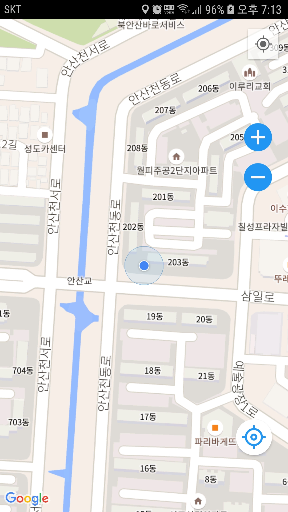
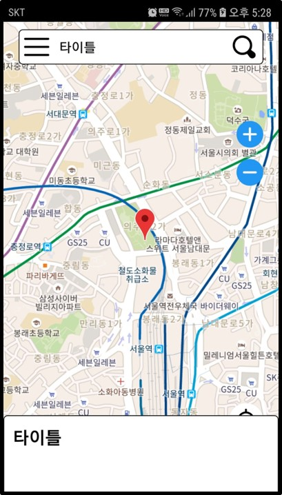

## EC Project 일지

- 목표 : 마커를 이용하여 다양한 카테고리로 분류하여 이용자가 원하는 마커를 찾고 등록함으로써 서로 소통할 수 있는 애플리케이션
- 환경
  - AndroidStudio 4.0, only Kotlin
  - Spring Legacy Project
- 사용된 라이브러리
  - RxJAVA
  - Retrofit
  - OkHttp3
  - GSON
  - Coroutine
  - Room
  - ViewModel
  - LiveData
  - ContentResolver
  - GoogleMap
  - BottomSheet
  - Glide
  - ViewPager2
  - BottomNavigation
  - TabLayout
  - RecyclerAdapter
  - FragmentStateAdapter

### 2020.07.16

- 스프링서버구현, 안드로이드 컴포넌트(탭레이아웃, 뷰페이저2, 프래그먼트 ) 구현

- 스프링서버와 안드로이드 retrofit과 연결 시도

- 실패

- 제이슨 일치시키기, 스프링에서 쏴주는 형식을 찾아보기

- rest ful로 동작하는지 스프링서버에 문제 확인해보기

### 2020.07.17

- 스프링서버와 안드로이드 retrofit과 연결 재시도

- rest ful로 동작잘됨


- 스프링 문제로 가정하고 다른 json형식을 retrofit과 연결될 수 있도록 시도

- retrofit이 다른 사이트의 데이터는 받아온다

- 내가만든 Spring json return raw data와 다른 사이트에서 받아온 raw data 형태가 다르다

- 형태의 문제가 아니였다

- 기존 Spring에서 복사한 VO객체의 Date 가 java.sql.Date를 그대로 사용해서 파싱 형태가 맞지 않아 실패했던거다

- 내부적으로 GsonConverterFactory는 Date 타입은 java.util.Date인거 같다

- java.util.Date로 변경하니 성공하였지만 Date를 간결하게 String타입으로 받기로함(변수명은 일치시키고)


- retrofit 성공

- RxJava + Restrofit을 이용해서도 출력성공함

- 받은 데이터를 분류하는 작업과 안드로이드에서 입력한 데이터를 스프링으로 보내 글 등록하는 과정진행해야 될듯
- 추가적으로 다양한 요청방식에 대한 retrofit의 인터페이스 관련해서 til작성

### 2020.07.18
- 이전에 받은 데이터를 FragmentStateAdapter를 어탭터를 사용하는 ViewPager로 연동되는 fragment에 데이터를 전달시켰다
- RecyclerView와 같은 방식이였음
- StackOverFlow에서도 비슷한 방식을 쓰는거보니 onBindViewHolder로 하는게 맞는거 같은데 FragmentStateAdapter에대한 정보가 주변에 많이 부족하다
- 아직 TIL에 다양한 요청방식에 대한 retrofit의 인터페이스 관련해서 작성은 다음으로 미루고 오늘한 Bind만 작성했다
- 또한 글 등록 요청을 서버에 보내는 것도 밀렸다

### 2020.07.19

- retrofit에 대한 TIL정리 마무리했다
- retrofit을 정리하면서 RxJava에 대해서도 알아야 할 것이 많아졌다
- retrofit 관련 정보를 보다가 버스정류장 시간을 받아오는 간단한 앱이 있는데 실제로 만들면 가볍게 시간을 확인할 수 있을듯
- 서버에 요청하는 로직은 Retrofit + RxJava가 마무리 되는데로 진행할듯

### 2020.07.20

- retrofit을 이용하여 스프링 서버에 요청하여 명령을 수행시켰다
- GET방식 요청은 정상작동되는데 POST방식으로 하면 인코딩이 깨진다


- 인코딩 방식에 대해서 더 알아봐야 겠다
- Retrofit + RxJava을 이용하면 MVVM 디자인 패턴을 사용하는거 같다.
- 인코딩완료 후 프로젝트를 간단한 MVVM 패턴으로 변경해본다

### 2020.07.21

- 인코딩 문제때문에 문제해결을 하던 중 okHttp + RxJava + Retrofit으로 하나의 클래스로 만들어 좀 더 간결하게 만듬
- 인코딩 문제는 여전했지만, 많은 글들을 참고했고 똑같이 했는데 안되는걸 보고 스프링 인코딩 문제라 생각하고 찾던 중 web.xml에

```xml
<filter> 
    <filter-name>encodingFilter</filter-name> 
    <filter-class>org.springframework.web.filter.CharacterEncodingFilter</filter-class> 
    <init-param> 
       <param-name>encoding</param-name> 
       <param-value>UTF-8</param-value> 
    </init-param> 
    <init-param> 
       <param-name>forceEncoding</param-name> 
       <param-value>true</param-value> 
    </init-param> 
</filter> 
<filter-mapping> 
    <filter-name>encodingFilter</filter-name> 
    <url-pattern>/*</url-pattern> 
</filter-mapping> 
```

- `<filter-mapping>`의 `<url-pattern>`이 기존에 `/`로 된걸 `/*` 바꾸고
- `forceEncoding`을 추가했더니

- 기존 인코딩 깨지던 것에서 POST방식으로도 정상적으로 서버에 요청할 수 있게 되었다
- 인코딩 설정 전에는 GET방식은 잘 되었다
- 참고 : [https://gmlwjd9405.github.io/2019/01/01/spring-utf8.html](https://gmlwjd9405.github.io/2019/01/01/spring-utf8.html)
- MVVM 패턴으로 변경하는 일도 어렵고 MVVM 패턴을 이해하는데 많은 시간이 필요할듯
- 구글, 네이버, 카카오 맵 API 적용시키는 중(현재는 구글맵 적용중)


### 2020.07.22

- 구글맵 API를 사용 중에 있다
- 클러스트 매니저를 통해 기본 클러스트 렌더를 이용하여 마커의 밀집도가 높은 곳을 보기쉽게 변경하였다


- 마커를 클릭했을때 이벤트를 발생시키게 만들었다

- 현재는 토스트 메세지로 해당마커의 위치값을 출력시켰다

  

- 또한 마커도 커스텀으로 디자인할 수 있는데 사이즈는 32px*32px가 기본 마커와 사이즈가 비슷하다

  

- 다음에는 관련 내용 TIL에 정리
- 그리고 DB에 마커 관련 데이터를 넣고 앱을 실행할때 Retrofit으로 정보를 받아와 마커로 나타내는 것을 목표로 한다
- 클릭하여 마커를 추가하고 사용자가 데이터를 입력하여 DB처리되는 것까지 포함
- 또한 클릭이벤트로 액티비티를 파업으로 띄우는 것도

### 2020.07.23

- TIL에 GoogleMap기본설정, 퍼미션, 자신의 위치찾기, 마커 클러스터링, 커스터마이즈 작성함
- 정리 하던중 구글맵과 외부 데이터와 연동시키는 에제를 확인했는데 인터넷으로 받은 JSON데이터를 AsyncTask로 처리했는데 적당한 방법을 찾아봐야될듯
- `(HTTPLog)-Static: isSBSettingEnabled false` 관련 문제 해결해야함
- 다음에는 DB테이블작성과 Retrofit을 이용해 적당한 방법으로 연동시키는것을 목표

### 2020.07.24

- AsyncTask에 대안으로 RxJAVA, Coroutines이 존재하는데 기존에 RxJAVA를 통해 인터넷 연결을 시도했기에 일단 RxJAVA로수행
- 코루틴이 RxJAVA보다는 쉽게 사용할 수 있지만 구체적인 수행방법은 RxJAVA가 아직까지 좋고 코루틴은 사용자가 하나하나 만들어야하는 모양이다
- 수행계획
  - 1단계 : ~~DB설계 -> 마커,맵 클릭리스너 구현 -> 팝업UI, 등록UI제작~~ -> 등록, 조회 컨트롤러 구현 -> 마커로 전체적으로 구현
  - 2단계 : 카메라움직임에 따라 해당위치에서 카메라die시 데이터 받고 뿌리기
  - 3단계 : 디버깅
- 구글맵 클릭이벤트 처리 후 얼럿다이알로그, 팝업액티비트를 통해 마커를 등록하고 마커 클릭시 매니저로 부터 만들어진 아이템클릭리스터에서 제목을 토스트메시지, 객체 값을 로그캣에 출력
- 클러스트 매니저를 cluster()메소드를 실행하면 새로고침되고 마커 등록 직후 하면 등록된 마커가 바로 보인다
- 맵을 이동하면 자동적으로 cluster() 가 수행됨
- 클러스터도 정상 작동하여 밀집된 구역에서 자동적으로 렌더됨


- 팝업 액티비티 UI는 지속적으로 디자인이 필요할듯

### 2020.07.25

- 휴가

### 2020.07.26

- 마커등록 얼럿에 주소언급 추가, 팝업UI 마진추가, 토스메시지가 아닌 팝업UI로 변경
- 지오코더를 통해 데이터 추가, 확인시 주소가 보일수 있도록함
- 주소추가와 함게 등록시 토스트메시지로 어디에 등록했는지 주소와 함께 보여줌
- DB테이블 수정(주소 컬럼 데이터 크기 확장, 일부 위치의 주소가 길어 insert 오류가 발생했었음)
- 수행계획
  - 1단계 : ~~DB설계 -> 마커,맵 클릭리스너 구현 -> 팝업UI, 등록UI제작 -> 등록, 조회 컨트롤러 구현 -> 마커로 전체적으로 구현~~ -> 수정하기(추가됨)
  - 2단계 : 카메라움직임에 따라 해당위치에서 카메라die시 데이터 받고 뿌리기(많은 데이터를 추가해야 할것 같음)
  - 3단계 : 디버깅

- 스프링 서버에 데이터를 저장하고 뷰로 볼 수 있게 만듬
- 앱 실행시 보유한 데이터가 적어 위치(맵의 크기, 카메라 상태)에 상관없이 전부 받아와 맵에 뿌려줌
- 수정버튼기능 추가해야하고 불필요한 기능들 정리해야함
- H2 DB가 다른 sql명령어가 다른듯

### 2020.07.27

- 싱글톤 방식으로 ClusterManager 를 처리하려고 시도중 하지만 다소 어려운 점이 있어 처리하는데 다소 시간이 걸릴듯
- 수행계획
  - 1단계 : ~~DB설계 -> 마커,맵 클릭리스너 구현 -> 팝업UI, 등록UI제작 -> 등록, 조회 컨트롤러 구현 -> 마커로 전체적으로 구현  -> 수정하기(추가됨)~~
  - 2단계 : 카메라움직임에 따라 해당위치에서 CameraIdle시 데이터 받고 뿌리기(많은 데이터를 추가해야 할것 같음)
  - 3단계 : 디버깅

- 마커 수정 후 다시 클러스터링하여 마커를 새로고침할 수 있도록 변경함
- 스프링에서 update, getSingleData 컨트롤러 만들고 수정함

### 2020.07.28

- 카메라 위치를 사용자가 이동 후 정지되는 순간을 인식하는 리스너 설계
- 이 리스너를 통해 사용자가 보는 위치를 기준으로 주변의 마커를 받아오도록 할 수 있음
- 사용자가 보는 위치 기준으로 카메라 줌 인/아웃 커스텀 버튼으로 제작
- 현재위치를 찾는 커스텀 버튼을 만들고 현재위치 트래킹하는 기능 만드는 중
- 사용자가 카메라를 움직일때만을 감지해서 현재위치 버튼을 비활성화 시켜야함(목적을 생각해서 위치를 지속적으로 추적하는 기능이 필요한가를 고려해본다)
- 수행계획
  - 1단계 : ~~DB설계 -> 마커,맵 클릭리스너 구현 -> 팝업UI, 등록UI제작 -> 등록, 조회 컨트롤러 구현 -> 마커로 전체적으로 구현  -> 수정하기(추가됨)~~
  - 2단계 : ~~카메라움직임에 따라 해당위치에서 CameraIdle~~시 데이터 받고 뿌리기(많은 데이터를 추가해야 할것 같음) -> 기능 수행버튼 추가(탭레이아웃 or 탭네비게이션 등)
  - 3단계 : 디버깅 및 디자인 변경


### 2020.07.29

- BottomNavigationView와 구글맵연동 중
- 버텀네비게이션과 구현할 기능으로 마스크API를 통해 주변 약국을 확인하면서 CameraIdle을 이용하여 마커표시하는 프로토타입 기능추가하기
- 외부 API를 이용하는 방식이고 구현된 구글맵 기능을 적극 활용할 수 있을 듯
- 수행계획
  - 1단계 : ~~DB설계 -> 마커,맵 클릭리스너 구현 -> 팝업UI, 등록UI제작 -> 등록, 조회 컨트롤러 구현 -> 마커로 전체적으로 구현  -> 수정하기(추가됨)~~
  - 2단계 : ~~카메라움직임에 따라 해당위치에서 CameraIdle~~시 데이터 받고 뿌리기(공적마스크 API를 통해 데이터 넣기) -> 기능 수행버튼 추가(탭레이아웃 or ~~탭네비게이션 등)~~
  - 3단계 : 디버깅 및 디자인 변경 및 수정


#### 2020.07.29추가됨

- 공적마스크 API가 중단된듯하여 다른 기능을 추가할 예정
- 서버에 연결안될 경우(밖에 나갔을때) ROOM을 이용하여 SQLite에 마커를 저장시키고 서버가 연결됬을 경우 mDB에 값을 서버에 업로딩하는 기능만들기(이 기능에 초점 맞추기)

### 2020.07.30

- 구글맵에서 클러스터링을 하기위해서는 setOnCameraIdleListener() 메소드에 클러스터 매니저를 넣어야 한다
- 그렇게 되면 setOnCameraIdleListener() 를 사용자가 화면을 움직이고 멈추는 것을 감지하는 리스너로 못쓰게 된다
- 클러스터 기능과 사용자가 카메라를 멈췄을때를 감지하는 두 기능을 같이 할 수 있는지 찾아봐야겠음
- Room을 이용하여 `entity`, `dao`, `Roomdatabase`를 구현하였다
- entity는 기존의 MarkerDataVO에서 구현시킴
- 현재는 wifi의 ssid, bassid 두가지를 비교해서 서버에 접속 중인 것을 확인하도록 했다(추후 서버와 컨택트하는 형태로 변경할 예정)
- 그 후 접속 중일 경우 등록되지 않은 마커가 mobileDB에 있을 경우 서버에 업로딩시키고, 마커 등록기능과 함게 수행할 수 있도록 설계하도록 한다
- 비접속중일 때는 mobileDB에 마커를 저장하고 사용자가 mobileDB로도 볼 수 있게한다, 또한 서버에서 최근에 받은 마커 또한 보여줄수 있도록 한다. 단 수정
- 진행상황
  - 서버연결됬을 경우
    - 앱 실행 후 mobileDB를 확인해 동기화 안된 값을 서버에 업로딩 시키고 동기화 처리(미구현)
    - 앱 실행 후 코루틴으로 DB로 전체 리스트를 받고 DB에 저장한다. 여기서 중복되는 값(이전에 저장된 것)이 있으면 교체시킨다(구현)
    - 그리고 받은 데이터를 코루틴을 통해 맵에 클러스터매니저로 마커를 추가한다(구현)
  - 서버연결안됬을 경우
    - 앱 실행 후 기존 서버에서 받은 mobileDB의 데이터를 마커로 뿌려준다(구현)
    - 마커를 추가하게 될 경우 DB에 저장시키고 동기화가 안되었다는 값을 넣어준다(미구현)
    - 기존의 기능인 마커 수정 기능 락걸기(추후에 삭제기능도 추가할 예정)(미구현)


> 서버가 TomcatServer이기에 wifi를 사용하지 않으면 서버에 접속못한다.
>
> 또한 LTE를 사용하지 않아도 mDB에 의해 마커는 나타난다

###  2020.07.31

- 진행상황
  - 서버연결이 될 때
    - 앱 실행 후 mobileDB를 확인해 동기화 안된 값을 서버에 업로딩 시키고 동기화 처리(구현)
    - 앱 실행 후 코루틴으로 DB로 전체 리스트를 받고 DB에 저장한다. 여기서 중복되는 값(이전에 저장된 것)이 있으면 교체시킨다(구현)
    - 그리고 받은 데이터를 코루틴을 통해 맵에 클러스터매니저로 마커를 추가한다(구현)
  - 서버연결이 안될 때
    - 앱 실행 후 기존 서버에서 받은 mobileDB의 데이터를 마커로 뿌려준다(구현)
    - 마커를 추가하게 될 경우 DB에 저장시키고 동기화가 안되었다는 값을 넣어준다(구현)
    - 기존의 기능인 마커 수정 기능 락걸기(추후에 삭제기능도 추가할 예정)(구현)
- 데이터 삭제 후 인터넷 연결시 새롭게 데이터를 받아오지만 클러스터 매니저를 통해 아이템을 추가시키지 못한 부분 수정 (데이터, 캐쉬 삭제 후에도 정상 작동되기 바꿈)
  - RxJava와 Coroutine사이의 처리순서가 맞지 않았던 부분을 수정함

- 이미지 업로드 기능을 추가할 예정이다
  - 리싸이클러 뷰를 이용하여 다수의 사진을 볼 수 있게 할 예정

### 2020.08.01

- 이미지 업로드 기능을 만들기 위해 DB 테이블 추가하고 로컬에 이미지를 담는 폴더를 생성하였다
- 그리고 서버가 데이터를 받으면 폴더에 이미지를 저장하고 경로를 DB에 저장하는 형태로 설계하였다
- 현재는 안드로이와 스프링 서버간 이미지를 객체 형태로 다수의 이미지를 주고받을 수 있는 방안을 찾고 있다
- BottomNavigationView Item 디자인 수정 중, bottomNavigation으로 구글 맵과 연동시킬 수 있는 view 구상 중

### 2020.08.02

- 사진업로드 구현에 성공했다. 사진에 오늘만 7시간 매달렸다
- 현재는 이미지 파일만을 업로드 시키는 테스트를 진행했다
- 다음에는 객체에 넣어 넘기는 방식으로 수정할 것이다
- 또한 다수의 이미지 진행할 것이다
- 마찬가지로 서버에서도 파일과 객체와 분리시켜 db처리


- 디자인은 지속적으로 고쳐나가야겠다

### 2020.08.03

- 안드로이드
  - 안드로이드에서 마커데이터와 이미지를 함께 보낼 수 있도록 MultiPart를 이용해 처리했다
    -  retrofit interface에 @Multipart를 사용하여 기존의 방식 대로 보내면 데이터에 `"` (doublequotes ) 가 붙는 문제를 해결
  - 안드로이드 UI와 로직을 다수의 이미지로 처리할 수 있도록 만들고 있다 (미구현)
  - 안드로이드에서 기본으로 제공하는 갤러리가 아닌 다른 갤러리로 열기 수정할 방법 모색
  - 다수의 이미지를 선택할 수 있지만 다수의 이미지로 처리하지는 못함  (미구현)
  - 이미지 선택 후 imageView나타나는 사진 해상도가 높을시 성능저하 문제발생
- 서버
  - 하나의 컨트롤러를 이용해 이미지 존재 여부에 따라 처리할 수 있게 하였다
  - 다수의 이미지를 받을 수 있도록 수정했다
  - 이미지를 추후 DB와 연동할시 중복되는 파일명을 방지하기위해 랜덤문자와 함께 파일을 저장했다


### 2020.08.06

- 서버
  - 이미지와 데이터 객체간의 seq값을 이용해서 두개의 테이블로 나뉜것을 하나의 컨트롤러에서 처리하여 insert할 수 있게 처리
    - 이미지 DB에 주소값과 파일이름을 저장해 데이터값을 보고 로컬에서 찾는 방식사용
  - 서버에서 다수의 이미지를 보내는 컨트롤러 설계함
    - stream을 통해 로컬서버에 존재하는 파일(이미지)를 처리함 하지만 아직 안드로이드가 이에 대한 응답을 못받아서 컨트롤러, 안드로이 문제인지 파악 중에 있음
- 안드로이드
  - 고해상도일때 성능저하 문제 해결
    - 사용자에게 보여지는 View의 해상도를 수정함
  - 마커등록시 seq값이 매핑되지 않는 문제 발견, 서버와 동기화 하면 seq값이 생김 (DB와 mDB간 일치함) 등록시에도 매핑되기 수정해야함
  - 서버에 설계된 이미지를 보내는 컨트롤러로 부터 데이터를 받지 못함 500 오류를 받음
    - 내부서버 문제(500 error)라 나오는데 스프링서버에서는 오류메시지는 확인되지 않음
    - 파일로 로컬파일을 불러와 파일이 갖는 정보를 출력이 잘됨
  - 기본 갤러리도 나쁘지 않아 유지할 계획(다른 갤러리로 열 수 있는 방법도 알아갈것임)
  - 아직까지는 다수의 이미지를 업로드할 수 없게 막음(기능은 수행할 수 있고 수신테스트가 완료되면 수정할 계획)
- 전체적인 흐름을 만들었고, 서버로 부터 이미지를 받는 기능만 수행하면됨

### 2020.08.07

- 기존에 MultipartFile을 통해 이미지를 보내려고 했는데 너무 다루기 어려워 포기했다
- 대신 기존에 자주 사용하는 방식인 서블릿 설정파일에 resource를 통해 내부파일을 보는 형태로 변환했다
- 안드로이드에서 특정 마커의 seq를 통해 요청하면 서버가 해당 seq에 매칭되는 이미지를 DB에서 찾아 리다이렉션하여 안드로이드에서 받을 수 있도록 만들었다.
- 아직은 다수의 이미지를 보여주기 위해서는 어떻게 해야할지 찾아봐야겠다.
- 디자인은 계속 수정해야하는데 어렵다
- 마커 초기등록시 바로 클릭하면 seq가 지정안돼는 문제 디버깅해야함 하지만 재실행 후에는 동기화 처리로 seq값이 설정됨


### 2020.08.08

- 서버와 연결 안될시 비동기 데이터를 처리할 수 있게 만듬

  - 현재 사진을 포함한 비동기 데이터에서 uri를 저장 후 실행후 서버연결을 확인 후 동기화 처리 중 다음 오류발생하여 처리해야함

  - ContentResolver 관련 문제인듯한데 다른 개발자와 같은 형태코드인데 내 애플리케이션에서만 다음 오류가 뜬다

    ```
    java.lang.SecurityException: Permission Denial: opening provider com.android.providers.media.MediaDocumentsProvider from ProcessRecord{59c5f6d 356:com.example.firstkotlinapp/u0a68} (pid=356, uid=10068) requires that you obtain access using ACTION_OPEN_DOCUMENT or related APIs
    ```

  - 구조적으로는 동기, 비동기 데이터를 처리할 수 있다

- 이전부터 지속적으로 seq 지정안된 문제를 서버연결되거나, 안되거나 모두 정상적으로 처리할 수 있게 수정함

- 중복되는 변수 선언 삭제

- CRUD 기능 중 삭제기능 추가예정

- 탭 네비게이션을 이용하여 다른 뷰도 만들어 기능추가 예정
  
  - 수동 동기화
  
- multipart + retrofit으로 이미지 전송하는 것과 그것을 다시 받는 방법 til 정리예정

### 2020.08.09

- 비동기 데이터 오류를 해결하기 위해 관련 테스트 앱을 만들어서 오류가 발생하는 기능인 ContentResolver 문제 해결시도함(테스트 앱으로 원인을 파악 못함)
- 문제에 다시 설명하면 서버와 연결안됬을시 마커를 등록할때 사진과 함께 할시 DB에 사진을 넣는 것이 아닌 uri를 스트링으로 변환하여 DB에 저장했다가 서버와 연결이 되면은 toUri()로 변환하여 기존의 서버연결이 됐을때와 마찬가지의 메소드를 실행했지만 ContentResolver에서 다음 오류가 발생했다

```
java.lang.SecurityException: Permission Denial: opening provider com.android.providers.media.MediaDocumentsProvider from ProcessRecord{59c5f6d 356:com.example.firstkotlinapp/u0a68} (pid=356, uid=10068) requires that you obtain access using ACTION_OPEN_DOCUMENT or related APIs
```

- 해결하였고 문제 발생 원인은 몇가지가 존재했다
  - 우선 퍼미션오류에 관련해서다
    - 서버와 연결시 앱 실행후 마커에 사진과 등록할시 해당 uri에 시스템 앱이 uri권한을 부여하고 그 즉시 ContentResolver를 통해 uri을 retrofit으로 전송하는 형태로 변환시켰다.
    - 하지만 앱이 종료되면 시스템 앱이 부여한 uri에 대한 권한은 사라진다
    - 나는 서버와 연결안됬을시 마커에 사진과 등록 후 앱을 종료했고, 이때 권한이 사라졌고, 앱을 다시 실행하고 동기화 처리과정 중 mDB에서 권한이 없는 uri를 잡고 ContentResolver를 사용했기에 위에 대한 오류가 발생한것이다
    
  - `requires that you obtain access using ACTION_OPEN_DOCUMENT or related APIs` 에 대해서는
    - 파일을 선택하기 위해 `startActivityForResult`를 수행하기 위해 `intent`를 설정하는 과정에서`action`이 `ACTION_OPEN_DOCUMENT`이 아닌 `ACTION_GET_CONTENT`로 지정되있었다.
    - 서버와 연결될을 시에는 문제 없었지만 다음에 설명하는 권한 유지를 위해서는 변경되어야 했다
    
  - 유지되지 않는 권한
  
    - 구글 developer에서 권한유지에 대한 문서를 찾았다
    - [https://developer.android.com/guide/topics/providers/document-provider.html#permissions](https://developer.android.com/guide/topics/providers/document-provider.html#permissions)  (중요한 내용은 아래있더라)
    - 해당 문서에 의하면 파일을 선택하고 작업을 처리 후 권한이 없어 다시 파일 선택기로 넘어가서 선택하게하는 곤란한 작업을 막아준다
    - 그래서 나도 이에 대해서 서버와 연결안되고 마커와 이미지를 등록했을때 `onActivityResult`에서 해당 uri에 권한을 유지시키도록 했다
    - 결국 앱을 삭제하는 상황이 아닌이상 동기화 처리를 완료했다

- 지금까지 많은 문제들이 있었지만 지금까지 **이 문제가 가장어려웠고** 안드로이드에 대해 구조에 많은 이해가 필요했다

- 문제를 해결하고 남은 더미 데이터삭제, 일부 메소드 다른 클래스로 변경함

- CRUD 기능 중 삭제기능 추가예정

- 탭 네비게이션을 이용하여 다른 뷰도 만들어 기능추가 예정

  - 수동 동기화

- multipart + retrofit으로 이미지 전송하는 것과 그것을 다시 받는 방법 til 정리예정

### 2020.08.10

- 로컬서버로 만들었는데 왜 외부에서 접속이 되는지 찾았다
  - pc가 공유기에 연결되어서 공유기설정으로 외부접속을 차단하는줄 알았느데, 모뎀에 바로 연결되있었다.
  - 로컬서버로 테스트용으로만 설계하려했는데 그냥 외부접속도 허용한다
  - 단, 서버접속 유무를 알기위해 기존에는 특정 wifi의 mac주소를 사용했는데, 방향을 다시 잡아야겠다

- 삭제기능 구현
  - 로컬 데이터삭제, DB처리
  - 스프링 컨트롤러 수정
- 전체적인 디자인 구상 후 작업시작예정

### 2020.08.11

- 검색과 관련된 UI디자인을 진행 중에 있다
- 검색뷰 관련해서 프래그먼트로 생성하려고 하는데 기존에 만든 뷰페이저 어댑태와 연결 중에 있다


### 2020.08.12

- 스케치 디자인이 실제UI로 어느정도 완성이 되었다
- 버튼관련 로직처리 중에 있다
  - 초기화면에 상단 검색바를 클릭시 검색프래그먼트가 나타난다
  - back버튼 로직, ViewPager로 검색 화면 나누는 어탭터, 검색정보 메인액티비티에 보내기 정도까지 만들어야한다
- 디자인 너무 오래걸린다


### 2020.08.13

- back버튼 로직구현, viewPager로 검색기록, 카테고리로 나누고 프래그먼트로 각각 보여줄수 있게 만듬
- 검색프래그먼트가 실행되면 자동으로 키보드창이 뜨게만듬
  - 첫 실행할때는 작동하지 않고 앱을 내리고 열면 뜨는 형태이다
  - 각 상황에 맞게 키보드가 자동적으로 나타나게 수정할 예정
- 카테고리 탭 디자인 구상 중


### 2020.08.14

- 검색기록 리싸이클러뷰 디자인
  - 아이템간의 간격은 리싸이클러뷰에서 제공하는 기능말고 마진이나 기존에 사용한 방식 적용
  - 리싸이클러 뷰에서 제공하는 아이템 표시줄을 사용했는데 좋지않아 보류
  - 클릭이벤트 (삭제버튼 누를때 체크박스 표현)
  - 키보드비정상으로 나타나는거 수정
  - viewPager로 화면을 나누었는데 데이터 삭제 프래그먼트 때문에 backStack 처리가 어려울거 같다
  - 검색 데이터 삭제 프래그먼트 생성 (전체선택, 삭제기능 구현)
  - 데이터는 SharedPreference에 담을 예정
  - 다름앱과 비교해서 체크박스(이미지뷰)를 클릭할때 변화가 처리되는 속도가 느린데 이유는 찾아봐야 겠다 
    - 체크박스 컴포넌트로 하면 빨라질까?


### 2020.08.16

- 삭제 디버깅관련

  - LinearLayoutManager관련해서 버그가 존재하여 새롭게 리니어 레이아웃 매니저를 상속받은 클래스를 생성하여 리싸이클러뷰 매니저로 사용함
  - 삭제리스트 프래그먼트에서 삭제기능 구현완료
  - ~~하지만 삭제 후 다시 리스틀 넘어오면 즉각 반영이 안되는 문제있음~~ 구조를 바꿔서 해결함
    - 클릭시 refresh됨
    - notifyChanged 잘 안됨

- 카테고리탭 작업 중
  - FlexboxLayout을 이용하여 viewType에 맞게 그리드 형태로 변환시키는 중
  - 타입과 구성요소로 viewType을 나눔
  - 현재 나누어서 타입을 나누는 것이 적용안된다면 하나의 타입으로 수정할 예정

### 2020.08.17

- 카테고리 탭 디자인 완성
  - 아이템이 추가됨에 따라 리스트 수정과 아이콘 수정이 있을 예정
  - FlexboxLayout과 ViewType을 이용하여 타입과 구성요소로 나누어 카테고리를 분류시켰다
  - 두개의 타입으로 나누는 것으로 완성시킴


- 소스파일 업로드

### 2020.08.19

- 검색기능을 위해 프래그먼트와 액티비티간에 데이터 전달이 필요함
  - 인터페이스 리스너를 처음에 적용했는데 잘 안됬음
  - 최근 LiveData를 통해서 프래그먼트간, 프래그먼트와 액티비트간에 데이터 전달을 쉽게하는것을 알게됨
  - LiveData를 이용하여 프래그먼트에서 검색한 검색어 데이터를 액티비티에 넘겨줌
  - observe를 통해 감지하므로 그와 동시에 서버와 연결하여 검색어와 연관된 마커를 리스트, 화면이동을 통해 보여줄 예정
  - 검색 프래그먼트의 리스트에도 관련 연관검색어를 보여줄 수 있도록 수정하겠다
  - sharedPreference로 검색기록 변경예정


### 2020.08.20
- 기존에 마커리스트에서 검색어 키워드 여부에 따라 구분하여 컨트롤러 수정함
- 검색어는 마커의 제목, 내용 두 가지에서 찾는다
- 현재는 찾은 마커가 1개일 경우 해당 마커로 이동시켰다


- 마커가 2개 이상일때에는 어떻게 할지 구상중에 있다
	- Bottom Sheet를 이용하여 리스트를 보여주는 형태
	
	- 스와이프로 넘겨서 지도와 함께 마커의 위치와 정보를 보여주는 형태


	

- 현재는 BottomSheet로 하고있는데 기존의 xml 디자인과 겹치는 문제로 수정중에 있다

### 2020.08.21

- BottomSheet와 기존XML과 겹치는 문제 해결
- 다수의 검색결과를 Retrofit+Coroutine으로 bottomSheet의 리싸이클러뷰로 나타냈다


- 아이템과 bottomSheet의 디자인은 수정할 예정
- 기존의 Retrofit과 Coroutine이 서로 싱크문제로 함께 쓸 수 없었는데 이번에 다시 시도하여 같이 쓸 수 있게 수정함
- bottomSheet의 디자인은 2개가 될 예정
  - recyclerView로 리스트로 보는 형태
  - ViewPager를 이용하여 좌우로 스와이프하여 아이템을 보는 형태

- 디자인 2개가 완료 후 clusterManager와 함게 로직처리예정

### 2020.08.22

- retrofit + coroutine을 통한 인터넷접속은 처음에는 간편해 보였으나 예외처리를 해주어야하는 단점이 있다
- 리턴타입이 single 등 이 아니여서 RxJAVA를 사용하지 못해 예외처리를 해줘야한다
- ViewPager2와 BootomSheet를 활용하여 검색결과를 나타내게 하였다


- viewPager2와 BottomSheet간의 터치이벤트가 문제가 있어서 수정해야함

- 2개의 디자인을 다듬고 구글맵과 연동예정

- recyclerView, ViewPager는 viewType을 나누어 하나 어탭터로 사용함

### 2020.08.25

- 구글맵처럼 마커를 클릭시 CoordinatorLayout과 bottomSheet를 이용하여 보여줄려고 했는데 상당히 어럽다
- 관련 라이브러리가 있는데 많이 불안정하고 아직 정식버전이 없어서 다양한 걸로 적용해봐야겠다


### 2020.08.26

- 카카오, 구글 맵과 다양한 샘플앱을 보았고, 라이브러리 없이 구현할 수 있는 방법을 찾았다
- 결론은 2개의 bottomSheet가 필요하다
  - 간략한 정보를 보여주는 작은 bottomSheet
  - 작은 bottomSheet를 위로 스와이프 할 경우(클릭, 스와이프 등의 이벤트)  CoordinatorLayout + AppBarLayout + CollapsingToolbarLayout + NestedScrollView 조합으로 이루어진 전체정보가 담긴 bottomSheet가 필요하다

- 첫번째 sheet는 기존에 만든거를 활용하면 된다
- 두번째 sheet는 샘플로 만들었다


- 두가지 스타일을 맞추고 자연스럽게 이벤트 동작하게 하면 카카오, 구글처럼 마커 이벤트를 만들 수 있다

### 2020.08.27

- 26일 NestedScrollView가 비정상적으로 작동하는 문제 디버깅
  - 스크롤 뷰에 내용이 더 있는데 스크롤이 일정구간에서 멈춰서 다 안보였음
- 스와이프로 상세내용이 bottomShett를 창을 내리고 이전 BottomSheet를 보여주도록 하였음


- 모든 디자인을 통일시키고 상세뷰를 내릴때 다시 viewPager가 나타날 수 있도록 수정할 예정

### 2020.08.29

- 드래그로 viewPager를 이동시켜 BottomSheet가 나오게 할려했는데 실패했다.
- 간단히 클릭과 스와이프로 상세뷰가 나타나게 했다.


- 카메라를 움직임 수정해야할 사항
  1. 검색하면 현재 위치에서 관련있는 마커로 카메라 이동
  2. viewPager클릭시 상세뷰가 나타남과 동시에 AppbarLayout에 해당 마커위치를 보여줄수 있도록 한다
  3. 검색바, 줌인아웃 버튼 숨기기
  4. 상세뷰를 내릴 경우 상세뷰를 내리기 직전의 카메라뷰로 넘길예정

- viewPager외에 floatingButton을 이용하여 List형태로도 추가해야한다
- viewPager에 vo객체로 담아야한다

### 2020.08.31

- 리싸이크럴뷰를 이용한 bottomSheet를 제외하고 검색부터 상세보기까지 완료하였다
- 검색바가 상세뷰와 지도를 볼때를 구분하여 표시하도록 만듬
- 검색바의 취소버튼을 통해 기본 뷰로 돌아갈 수 있게함
- 디테일 bottomSheet에 따라 주변 컴포넌트 변화


- 아직 검색시 검색된 데이터의 위치를 기반으로 카메라를 이동시키지 못함
- 검색된 데이터만 마커표시 해주는 기능 없음
- 디버깅, 디자인 수정해야함

### 2020.09.01

- bottomSheet에서 COLLAPSED된 CollapsingToolbarLayout가 버튼에 의해 내려진 후 다시 bottomSheet를 나타내면 COLLAPSED된 상태로 나타나는 것을 AppBarLayout에 addOnOffsetChangedListener 를 이용하여 수정함

- 디테일 뷰에서 스크롤 최상단인 경우를 감지해서 아래로 스와이프하면 디테일뷰 숨기는 기능 추가함 
  - 기존의 있던 기능이었는데 버그가 많았고, 이번에 추가된  addOnOffsetChangedListener와 함께 응용시켜 문제를 해결함

### 2020.09.02

- 총 3가지의 BottomSheet를 사용하여 서로간의 이벤트를 사용할 수 있게 했다
  - recyclerView, ViewPager2, AppBarLayout + CollapsingToolbarLayout + NestedScrollView
- 리싸이클러뷰에서 뷰페이저로 뷰페이저에서 리스트로 변환하는 기능 추가
- 리싸이클러뷰에서 클릭된 아이템은 뷰페이저에 바로 표시, 해당 마커로 이동
- backPress를 이용하여 물리버튼으로도 닫을 수 있고 스와이프로 내릴경우도 된다


- 기존에 마커클릭 이벤트는 popUpActivity에서 bottomSheet로 바뀔예정
- 선택되거나 해당되는 마커는 하이라이트를 줘야함

### 2020.09.03

- 마커클릭 이벤트를 popUpActivity에서 bottomSheet로 변경하였다
- 클릭된 마커를 주변마커과 구분하기 위해 색, 아이콘을 변경했다 (하이라이트)
- 마커가 밀집된 주변을 클러스트하는 기능을 기존의 구글의 onCameraIdle()와 연동못시켰는데 연동에 성공했다
  - 구글의  onCameraIdle()에 ClusterManger.cluster() 를 넣어주면 된다
- 이 과정에서 기존에 clusterManger를 사용하는데 마커 변경과 관련된 문제가 생겼다
  - 클러스터되어있는 마커(아이콘, 색)를 변경하려면 클러스터 매니저가 해제가 되여하는데 아이콘을 바꾸는 기능이 클러스터매니저에 있다
    - 이 해결책은 기본 구글맵에 있는 기능을 활용하면 되지만 통일이 사라지고 지저분한 코드가 생긴다
  - 클러스터 되어있는 아이템을 접근하면 null에 접근하여 문제가 발생한다
  - 문제의 해결책으로 클러스터매니저, 랜더러를 상황에 맞게 계속 제거, 생성해주는 것이 있다. 좋은 방법같지 않다
  - 앱의 기능과 목적에 맞게 다시 생각해야 해결책이 있을거같다

### 2020.09.06

- 마커를 클릭시 최근 위치와 줌레벨을 기억하고 마커뷰를 닫을시 다시 최근의 위치와 줌레벨로 복귀하는 기능 구현
- 밀집된 마커에서 찾는 것을 구분하기 위해 클릭된 마커, 안된 마커 아이콘 추가
- 최근 작업에서 클러스터로 인해 null값을 참조하는 문제 해결함
- 구글맵 기본으로 하지 않고 클러스터 매니저로 마커관련 이벤트 수정할 수 있도록 만듬


- 기본적으로 DB에 모든 마커를 처음부터 표시했는데 검색기능과 카테고리 기능을 이용해서 나타낼 예정
- 즐겨찾기 마커같은 경우 처음부터 표시하는 방향으로 구상중

- 현재 viewPager2에서 현재 보고 있는 아이템일 경우 화면을 이동시키는 기능을 구현했는데 중복적으로 adapter를 생성해서 리스트 크기가 다를 경우 예외가 발생해서 수정해야한다

### 2020.09.07

- viewPager 스크롤시 해당 아이템으로 이동시키는 기능 구현완료
  - 중복적으로 생성되는 문제 디버깅
  - 기존에 adapter 지속적으로 교체하는 방법에서 notifyDataSetChanged()를 이용함
- 지도가 로테이션될 경우 클릭시 해당마커를 줌 못하는 문제가 있음, 회전각에 맞춰서 조정해줘야 된다
  - 수학적으로 해석해야 할거 같은데 어렵다

- 중첩되면 구분안되는 마커 구분될 수 있도록 디자인 변경


### 2020.09.08

- 기존의 LiveData만을 이용하여 검색창의 검색어를 변경했다
- 이번에는 본격적으로 MVVM패턴을 이용하여 view에서 검색시 ViewModel의 정의된 retofit으로 MutableLiveData를 받아 이 데이터를 다시 view에서 값을 observe하여 view에서 UI작업만 할 수 있도록 MVVM패턴을 적용시켰다
- 동작은 이전과 완벽히 동일하게 동작하는 것 처럼보이지만 내부적으로 일부 기능을 MVVM패턴으로 바뀌었다.
  - 현재는 retrofit의 하나의 기능만 만들었다
  - 나머지도 다시 MVVM패턴으로 만드는데는 다소 시간이 소요될 것 같다
  - Room도 보통 MVVM패턴으로 활용하지만 이 앱에서는 배보다 배꼽이 더 커지는 경우가 될 것 같다. Room의 활용도가 크지 않기 때문에 그렇다. 그래서 활용방법을 찾아볼 예정
  - 아직 불안정하고 추가할게 많다
- 확실히 View의 코드가 줄어든것을 확인할 수 있었다

- 기존의 검색기능 중 일부 불필요한 코드제거함

### 2020.09.10

- 기존에는 Retrofit만 MVVM 패턴으로 변경했고, 이번에는 RxJAVA + Retrofit을 MVVM 패턴으로 변경하였다
  - MVVM패턴이지만 패턴내에서도 다양한 내부구성이 존재하여 간단하게 구현할 수 있는 방향으로 구성 중
- 초기 앱 실행시 전체마커를 웹에서 가져와 보여주는 기능을 MVVM패턴으로 변경하여 View에서는 ClusterManager만 사용하게 되었다(view에서는 UI작업만 하게되었다)
- 활용도가 적었던 Room은 MVVM패턴을 적용하기 위해 기존의 기능을 변경했다
  - 앱과 연결된 서버는 항시 접속가능하게 한다.
- Room은 서버와 연결안됬을시 기존에 저장된 모든 마커를 보여주었지만, 이제는 사용자가 저장한 마커데이터만 가진다
  - Room 데이터가 변경될시 변경사항을 MVVM패턴으로 반영시키기로 했다.
- 인터넷 연결을 안할시에는 동기화 처리되는 기능은 유지

- 기존에는 웹접속과 Room DB처리 기능을 Coroutine으로 묶어서 처리되어 결합력이 강했다. 이거를 Repository에서 분류하고 ViewModel에서 관리할 수 있도록 만들어 결합력을 낮추고 유지보수에 유리하게 만들 예정
  - 현재는 웹접속만 변경 중

- 이미지를 불러오는 기능을 MVVM패턴으로 변경했다


- 초기 마커를 클릭시 이미지뷰에 마커아이콘이 임시로 표시되는 것을 로딩아이콘으로 변경할 예정


- 서버에 해당하는 이미지가 있다면 성공 메시지를 받아 이미지를 이미지뷰에 그린다
- 서버에 해당하는 마커의 이미지가 없다면 실패 결과로써 로딩아이콘이 사리지도록 만든다

### 2020.09.11

- 로딩 GIF이미지를 보여줌으로서 로딩됨을 보여줌


- 기존 이미지 해상도 때문에 성능저하, out of memory발생가능성에 대한 방지책으로 `Android Develpoer에 큰 비트맵을 효율적으로 로드`를 참고했다
  - 원본 이미지 4608*3456이미지를 리사이즈하여 부드러운 UI처리를 할 수 있도록 했다
  - 다른 해상도의 이미지도 imageView에 맞게 자동적으로 해상도가 수정된다
- Glide를 통해 GIF이미지 로드하는데 첫 동작이후 작동이 안되는 버그가 있다.
- Glide 라이브러리 자체에 웹URL을 통해 out of memory문제를 해결하며 ImageView에 표시하는 자체기능이 있다
  - 이방법이 더 간단하여 retrofit을 사용하지 않고 간단하게 되는지 테스트할 예정

### 2020.09.13

- Glide자체의 URL로 이미지를 불어올 수 있지만 다른 예외사항에 대해 처리가 불리할 수 있기에 기존의 Retorift방식을 유지한다
- GIF이미지 로드하는데 첫 동작이후 작동이 안되는 버그는 호출되는 함수내에 liveData Observer가 있어서 두번 이상 등록되어 버그가 발생했다. onCreate or onMapReady에 넣어 해결함
- 11일에 사용했던 비트맵을 효율적으로 로드 문서에는 BitmapFactory.decodeResource()에 대한 내용이지만 해당 앱은 InputStream이 입력으로 들어오기에 BitmapFactory.decodeStream()을 사용했다.
  - 해당 안드로이드 개발자 문서 마지막에 decodeResource()로 BitmapFactory.decode*에 적용할 수 있다고 써있는데, decodeStream()를 사용하기 위해서는 BufferedInputStream으로 입력을 넣고 몇몇 코드가 바뀌어야 한다.
- 기존 Room dao 코드를 Room Repository와 ViewModel에 새롭게 만들었다
- 아직 MVVM패턴으로 Room관련 작업은 없다


### 2020.09.14

- Room관련 MVVM작업 진행 중이다
- Room관련 코드를 view에 반영시킬 수 있도록 수정했다
- 비동기 데이터에서 삽입, 수정해야할지 구분하여 오류발생 방지(primary key가 있는데 같은 key로 insert하면 앱이 튕김)
- 등록 후 기존에 사용된 코드로 seq 싱크가 안맞아 사진을 못 보는 버그 수정중
  - 기존에는 Room의 seq의 최신값으로 웹에 등록하였다.
  - Room의 사용용도가 달라저 이제는 등록시 DB에 있는 최신 seq값을 기준으로 데이터를 등록해야한다.
  - 기존의 방법은 한번 실수하면 싱크문제가 발생했는데, 이 방법은 안정적으로 해결할 수 있다.
  - 또한 비동기 데이터도 관련해서 동기화처리후 DB에 seq로 변환시켜줘야 한다
- detailBottomSheet에 내부저장소에 마커를 저장할 수 있도록 기능을 추가했다
  - 이미지 저장 관련해서는 좀더 생각해봐야 해야겠다.

### 2020.09.16

- 기존의 Retrofit, Room 코드만을 MVVM패턴에 맞게 전부 변환하였다
  - 현재는 기존에 사용한 코드로 사용하기에 처리코드를 변경된 패턴으로 전환 중

- 현재 서버, 안드로이드 코드에 문제없이 핸드폰 wifi, 네트워크 문제로 가끔 이미지를 못받는 버그있음
  - wifi, 네트워크 껐다가 키면 정상작동됨
  - 서버, 안드로이드 콘솔창에는 문제 없음
  - 일시적인 버그
- 기존 mDB마커 SEQ를 기준으로 이미지를 받아왔는데 스프링 컨트롤러 수정을 통해 mDB와 서버 DB의 primary key seq값을 맞춤

- 받아온 이미지를 구글에서 제공한 방식으로 리사이즈 방법을 Glide를 통해 자동적으로 처리하게 변경함
  - 안드로이드에서 추천하기 때문에 변경함

- 마커 등록 후 처리되는 로직을 변경된 MVVM패턴의 코드로 적용시킴
  - 15줄의 코드가 단 한줄로 줄었다
  - 마커 등록처리는 거의 완성되었다
- 마커의 뷰가 bottomSheet로 변경되어 아직 수정, 삭제는 어떻게 디자인할지 생각 중이다.
- 디자인이 잡히면 수정, 삭제 추가될 예정

### 2020.09.21

- 수정, 삭제에 대한 Activity 디자인 컨셉을 잡았다.
- 그에 맞게 기존의 수정, 삭제 코드를 MVVM에 맞게 변경함
  - view가 아직 완성안돼 사용되지는 않음
- 기존에 작성된 것을 새로운 디자인으로 변경중에 있고 기존에는 사진 한장만 업로드 시켰는데 다수의 이미지도 업로드하고 볼수 있도록 수정하고 있다.


- 추후 로그인 기능이 추가될 예정이기에 작성자 탭은 삭제시켰다

- 다수의 이미지 선택 후 onActivityResult에서 어떻게 Uri를 처리하는지 방법을 찾는 중이다.

### 2020.09.22

- editActivity에서 2개 이상의 이미지도 recyclerView에서 처리할 수 있도록 했다
- 기존에 다수의 이미지를 저정할수 있도록 만든 스프링 컨트롤러 정상작동하여 db, resource에 저장잘 됨
- 다수의 이미지를 가지는 비동기 데이터도 동기화처리할 수 있게함
  - 기존에 방법과 마찬가지로 uri리스트를 스트링으로 변환하여 mDB에 저장 후 동기화처리 과정에서 스트링을 uri리스트로 변환시킴


- 마지막으로 서버에서 다수의 이미지를 보낼때 안드로이드가 처리하는 기능만 만들면 된다.
- optionItem 글자 스타일 수정해야함

- 카테고리 추가기능 만들어야함

### 2020.09.23

- 다수의 이미지를 보기위해서 서버에 이미지 주소 객체를 먼저 요청하고 받은 객체의 주소값 리스트를 다시 비동기처리로 요청하여 이미지를 받아왔다
- 비동기 처리로 받아온 만큼 먼저 받은 이미지가 먼저 표시된다.
  - 매번 순서가 바뀐다
  - 이 문제는 좀 더 생각해봐야 겠다


- 기존 서버의 업로드 이미지 제한이 10mb로 설정되어 있어 고해상도 이미지를 3장만 업로드해도 제한에 걸려 업로드 제한은 대폭늘렸다.

- 업로드 과정에서 스프링서버 콘솔에 다음과 같은 에러메시지가 뜨는데 정상적으로 처리는 된다. 무슨 문제인지 확인해야한다


- 사진이 세로방향으로 찍은 것은 웹으로 보면 정방향으로 나오는데, 모바일에 바인딩 시키면 가로방향으로 바뀐다. 이것또한 해결해야한다
- 리싸이클러뷰가 추가되서 기존 bottomSheet디자인 수정해야함

### 2020.09.24

- 이미지를 요청하고 리싸이클러뷰에 바인딩하는데 문제점이 있었고 해결했다.
- **문제점 1**
  - 처음 마커가 클릭될시 해당 마커의 seq를 서버에 요청하여 이미지의 주소의 갯수를 받아 미리 리싸이클러뷰에 아이템을 생성하여 로딩이미지를 설정한 후 주소를 이용해 이미지를 서버에 찾아와 로딩이미지를 받아왔다
  - 그리고 찾아온 이미지를 BitmapFatory로 변환후 라이브데이터를 설정해주었다
  - 이 과정에서 마커를 빠르게 선택할 경우 (이미지가 많은 것에서 적은 마커를 클릭할경우) 리싸이클러 아이템 개수는 최근에 클릭한 것에 맞춰지는데 이전에 비동기로 요청을 처리하고 라이브데이터를 변경하는 과정에서 리싸이클러뷰 아이템갯수보다 많은 요청으로 앱이 비정상종료되었다(arrayOutIndex)
  - 즉, 최근클릭 직전에 대한 요청과 현재 요청이 오버랩되었다

  - **해결책**
    - CompositeDisposable 클래스를 이용했다
    - 마커의 주소값을 받아오는 메소드와 이미지를 받아오는 메소드에 Disposable를 추가하여 최신 요청이 들어오면 이전 요청을 취소시켰다

- **문제점 2**
  - 이전 요청을 취소했음에도 이미 bitmap으로 변환해 라이브데이터를 설정하는 처리는 막지못하였다.
  - **해결책**
    -  매개변수로 클릭된 마커의 seq를 넘겨주고 최신으로 클릭된 마커와 비교해서 라이브데이터를 변경하기로 했다


> compareMarkerImage가 서버로부터 받아온 마커의 seq(table_seq), id(marker_seq), file_address 정보를 담고 있는 최신의 데이터, 해당 메소드가 실핼될때의 seq와 비교

- **문제점 3**
  - 몇몇 요청은 막지만 그래도 이미 실행된 코드는 처리 못했다
  - **해결책**
    -  라이브데이터를 변경할때 bitmap만 넘겼지만 새롭게 data class(MarkerImageSubVO)를 만들어 seq, bitmap을 넘겨서 Activity에서 클릭한 seq와 라이브 데이터로 넘어온 seq를 비교해서 처리하게했다.


> clusterRenderData는 기존의 클릭된 마커 아이콘을 변경할때 사용한 변수를 재활용함

- 이미지 순서는 주소객체를 하나씩 동기 처리하면 해결할 수 있는데, 아직은 현재상태를 유지할 예정
- 스프링 서버 콘솔 오류는 encoding문제가 원인인데 어디서 인코딩 관련 문제가 발생하는지 찾는 중
- 가로이미지는 문제가 없는데 대부분의 세로이미지를 가로로 받는데, 이 문제 또한 해결책이 필요함

### 2020.09.25

- 마커 등록에 작성자 여부가 없어서 로그인 기능이 필요했다.
- firebase를 이용하여 구글로그인, 커스텀 로그인 등 강력한 기능을 제공한다.
- 로그인화면, 커스텀 사용자 회원가입 화면을 만들었다
- firebase를 이용하여 구글로그인, 커스텀 로그인을 구현하였고 정상적으로 작동한다.
- 처리되는 과정이 다소 걸리면 ANR이 발생한 것처럼 보이기에 프로그래세바를 생성해줘야 겠다.
- 디자인은 지속적으로 수정할 예정


### 2020.09.27

- 로그인처리, 회원가입 처리 중 ANR이 발생한 것처럼 사용자에게 나타났다
- 싱글톤으로 만든 dialog를 이용하여 처리가 되고 있다는 로딩화면을 보여주었다
- 로그인, 회원가입 중 발생되는 예외사항들을 사용자에게 알려주고 올바른 처리를 요구하도록 하였다.


> 중복 이메일, 닉네임 설정 실패, 로그인처리 실패 등에 대한 예외처리도 포함된다

- 구글 아이콘을 클릭시 해당 핸드폰에 로그인된 구글계정을 보여주고 해당 계정 클릭시 해당계정으로 로그인됨
- 디자인 수정은 지속적으로 변경될 예정

### 2020.09.28

- bottomNavigation 에 사용자 정보를 표시하고 로그아웃할 수 있는 프래그먼트 추가함

- Splash Activity를 추가하고 해당 액티비티에서 권한 설정을 할 수 있게 만듬

- Splash Activity를 추가하면서 액티비티 시작전 흰색 화면이 나타나 style.xml에 다음을 추가하여 해결함 

  ```xml
  <item name="android:windowIsTranslucent">true</item>
  ```

- 하지만  `Only fullscreen opaque activities can request orientation`오류가 발생했는데 일단 정상작동하도록 해결했는데 해당 오류에 대해 더 찾아볼 예정

### 2020.09.29

- 스플래쉬, 로그인 액티비티 디자인 수정

- `Only fullscreen opaque activities can request orientation`관련 오류 수정

- bottomNavigation 아이템이 4개 존재할시 해당 아이템 클릭시 backStack에 여려번 쌓지 않고 뒤로가기 버튼으로 순서에 맞게 되돌아가는 기능 구현 중

  