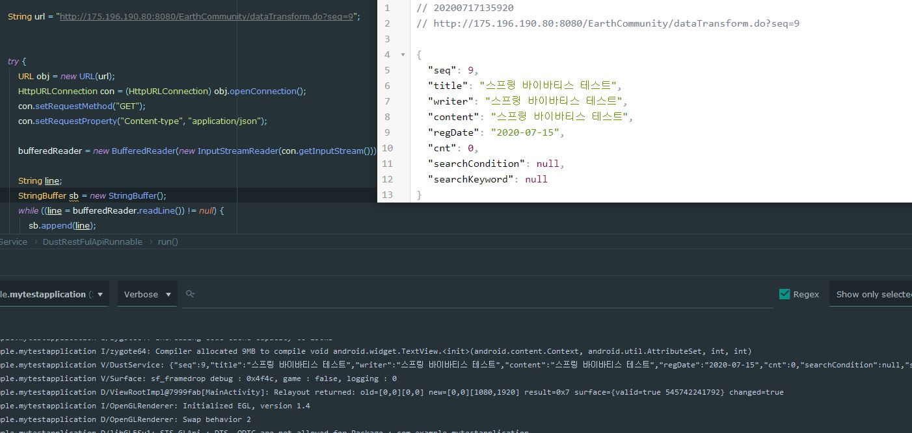

## 일지

### 2020.07.16

- 스프링서버구현, 안드로이드 컴포넌트(탭레이아웃, 뷰페이저2, 프래그먼트 ) 구현

- 스프링서버와 안드로이드 retrofit과 연결 시도

- 실패

- 제이슨 일치시키기, 스프링에서 쏴주는 형식을 찾아보기

- rest ful로 동작하는지 스프링서버에 문제 확인해보기

### 2020.07.17

- 스프링서버와 안드로이드 retrofit과 연결 재시도

- rest ful로 동작잘됨

- 스프링 문제로 가정하고 다른 json형식을 retrofit과 연결될 수 있도록 시도

- retrofit이 다른 사이트의 데이터는 받아온다

- 내가만든 Spring json return raw data와 다른 사이트에서 받아온 raw data 형태가 다르다

- 형태의 문제가 아니였다

- 기존 Spring에서 복사한 VO객체의 Date 가 java.sql.Date를 그대로 사용해서 파싱 형태가 맞지 않아 실패했던거다

- 내부적으로 GsonConverterFactory는 Date 타입은 java.util.Date인거 같다

- java.util.Date로 변경하니 성공하였지만 Date를 간결하게 String타입으로 받기로함(변수명은 일치시키고)

- retrofit 성공

- RxJava + Restrofit을 이용해서도 출력성공함

- 받은 데이터를 분류하는 작업과 안드로이드에서 입력한 데이터를 스프링으로 보내 글 등록하는 과정진행해야 될듯
- 추가적으로 다양한 요청방식에 대한 retrofit의 인터페이스 관련해서 til작성

### 2020.07.18
- 이전에 받은 데이터를 FragmentStateAdapter를 어탭터를 사용하는 ViewPager로 연동되는 fragment에 데이터를 전달시켰다
- RecyclerView와 같은 방식이였음
- StackOverFlow에서도 비슷한 방식을 쓰는거보니 onBindViewHolder로 하는게 맞는거 같은데 FragmentStateAdapter에대한 정보가 주변에 많이 부족하다
- 아직 TIL에 다양한 요청방식에 대한 retrofit의 인터페이스 관련해서 작성은 다음으로 미루고 오늘한 Bind만 작성했다
- 또한 글 등록 요청을 서버에 보내는 것도 밀렸다

### 2020.07.19

- retrofit에 대한 TIL정리 마무리했다
- retrofit을 정리하면서 RxJava에 대해서도 알아야 할 것이 많아졌다
- retrofit 관련 정보를 보다가 버스정류장 시간을 받아오는 간단한 앱이 있는데 실제로 만들면 가볍게 시간을 확인할 수 있을듯
- 서버에 요청하는 로직은 Retrofit + RxJava가 마무리 되는데로 진행할듯