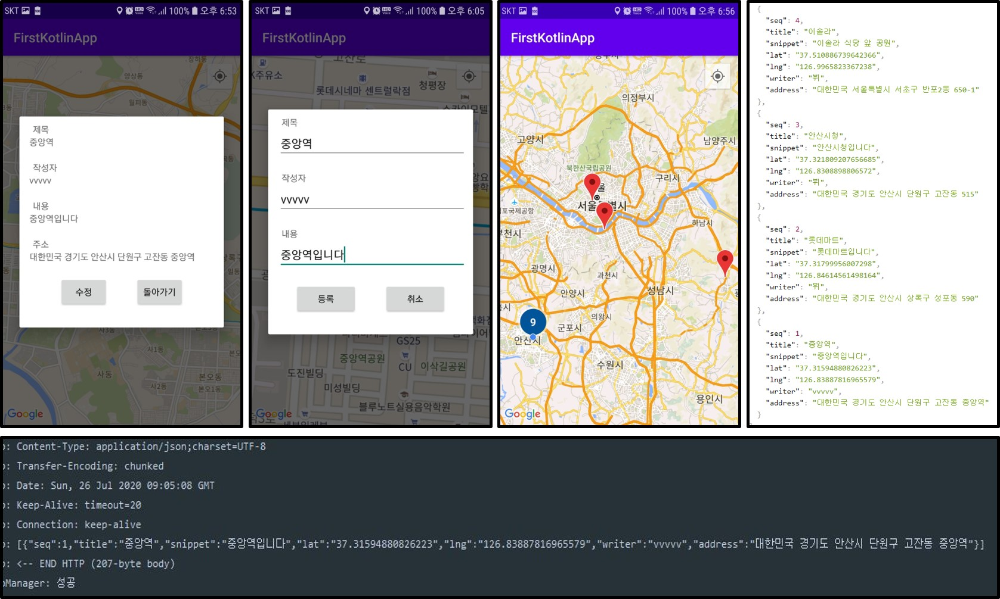
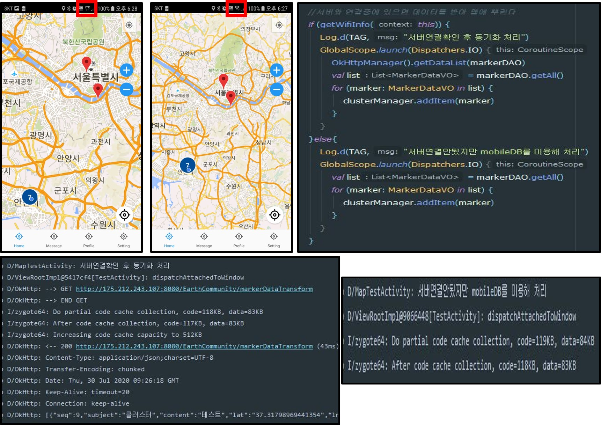

## 일지

### 2020.07.16

- 스프링서버구현, 안드로이드 컴포넌트(탭레이아웃, 뷰페이저2, 프래그먼트 ) 구현

- 스프링서버와 안드로이드 retrofit과 연결 시도

- 실패

- 제이슨 일치시키기, 스프링에서 쏴주는 형식을 찾아보기

- rest ful로 동작하는지 스프링서버에 문제 확인해보기

### 2020.07.17

- 스프링서버와 안드로이드 retrofit과 연결 재시도

- rest ful로 동작잘됨


- 스프링 문제로 가정하고 다른 json형식을 retrofit과 연결될 수 있도록 시도

- retrofit이 다른 사이트의 데이터는 받아온다

- 내가만든 Spring json return raw data와 다른 사이트에서 받아온 raw data 형태가 다르다

- 형태의 문제가 아니였다

- 기존 Spring에서 복사한 VO객체의 Date 가 java.sql.Date를 그대로 사용해서 파싱 형태가 맞지 않아 실패했던거다

- 내부적으로 GsonConverterFactory는 Date 타입은 java.util.Date인거 같다

- java.util.Date로 변경하니 성공하였지만 Date를 간결하게 String타입으로 받기로함(변수명은 일치시키고)


- retrofit 성공

- RxJava + Restrofit을 이용해서도 출력성공함

- 받은 데이터를 분류하는 작업과 안드로이드에서 입력한 데이터를 스프링으로 보내 글 등록하는 과정진행해야 될듯
- 추가적으로 다양한 요청방식에 대한 retrofit의 인터페이스 관련해서 til작성

### 2020.07.18
- 이전에 받은 데이터를 FragmentStateAdapter를 어탭터를 사용하는 ViewPager로 연동되는 fragment에 데이터를 전달시켰다
- RecyclerView와 같은 방식이였음
- StackOverFlow에서도 비슷한 방식을 쓰는거보니 onBindViewHolder로 하는게 맞는거 같은데 FragmentStateAdapter에대한 정보가 주변에 많이 부족하다
- 아직 TIL에 다양한 요청방식에 대한 retrofit의 인터페이스 관련해서 작성은 다음으로 미루고 오늘한 Bind만 작성했다
- 또한 글 등록 요청을 서버에 보내는 것도 밀렸다

### 2020.07.19

- retrofit에 대한 TIL정리 마무리했다
- retrofit을 정리하면서 RxJava에 대해서도 알아야 할 것이 많아졌다
- retrofit 관련 정보를 보다가 버스정류장 시간을 받아오는 간단한 앱이 있는데 실제로 만들면 가볍게 시간을 확인할 수 있을듯
- 서버에 요청하는 로직은 Retrofit + RxJava가 마무리 되는데로 진행할듯

### 2020.07.20

- retrofit을 이용하여 스프링 서버에 요청하여 명령을 수행시켰다
- GET방식 요청은 정상작동되는데 POST방식으로 하면 인코딩이 깨진다


- 인코딩 방식에 대해서 더 알아봐야 겠다
- Retrofit + RxJava을 이용하면 MVVM 디자인 패턴을 사용하는거 같다.
- 인코딩완료 후 프로젝트를 간단한 MVVM 패턴으로 변경해본다

### 2020.07.21

- 인코딩 문제때문에 문제해결을 하던 중 okHttp + RxJava + Retrofit으로 하나의 클래스로 만들어 좀 더 간결하게 만듬
- 인코딩 문제는 여전했지만, 많은 글들을 참고했고 똑같이 했는데 안되는걸 보고 스프링 인코딩 문제라 생각하고 찾던 중 web.xml에

```xml
<filter> 
    <filter-name>encodingFilter</filter-name> 
    <filter-class>org.springframework.web.filter.CharacterEncodingFilter</filter-class> 
    <init-param> 
       <param-name>encoding</param-name> 
       <param-value>UTF-8</param-value> 
    </init-param> 
    <init-param> 
       <param-name>forceEncoding</param-name> 
       <param-value>true</param-value> 
    </init-param> 
</filter> 
<filter-mapping> 
    <filter-name>encodingFilter</filter-name> 
    <url-pattern>/*</url-pattern> 
</filter-mapping> 
```

- `<filter-mapping>`의 `<url-pattern>`이 기존에 `/`로 된걸 `/*` 바꾸고
- `forceEncoding`을 추가했더니

- 기존 인코딩 깨지던 것에서 POST방식으로도 정상적으로 서버에 요청할 수 있게 되었다
- 인코딩 설정 전에는 GET방식은 잘 되었다
- 참고 : [https://gmlwjd9405.github.io/2019/01/01/spring-utf8.html](https://gmlwjd9405.github.io/2019/01/01/spring-utf8.html)
- MVVM 패턴으로 변경하는 일도 어렵고 MVVM 패턴을 이해하는데 많은 시간이 필요할듯
- 구글, 네이버, 카카오 맵 API 적용시키는 중(현재는 구글맵 적용중)


### 2020.07.22

- 구글맵 API를 사용 중에 있다
- 클러스트 매니저를 통해 기본 클러스트 렌더를 이용하여 마커의 밀집도가 높은 곳을 보기쉽게 변경하였다


- 마커를 클릭했을때 이벤트를 발생시키게 만들었다

- 현재는 토스트 메세지로 해당마커의 위치값을 출력시켰다

  

- 또한 마커도 커스텀으로 디자인할 수 있는데 사이즈는 32px*32px가 기본 마커와 사이즈가 비슷하다

  

- 다음에는 관련 내용 TIL에 정리
- 그리고 DB에 마커 관련 데이터를 넣고 앱을 실행할때 Retrofit으로 정보를 받아와 마커로 나타내는 것을 목표로 한다
- 클릭하여 마커를 추가하고 사용자가 데이터를 입력하여 DB처리되는 것까지 포함
- 또한 클릭이벤트로 액티비티를 파업으로 띄우는 것도

### 2020.07.23

- TIL에 GoogleMap기본설정, 퍼미션, 자신의 위치찾기, 마커 클러스터링, 커스터마이즈 작성함
- 정리 하던중 구글맵과 외부 데이터와 연동시키는 에제를 확인했는데 인터넷으로 받은 JSON데이터를 AsyncTask로 처리했는데 적당한 방법을 찾아봐야될듯
- `(HTTPLog)-Static: isSBSettingEnabled false` 관련 문제 해결해야함
- 다음에는 DB테이블작성과 Retrofit을 이용해 적당한 방법으로 연동시키는것을 목표

### 2020.07.24

- AsyncTask에 대안으로 RxJAVA, Coroutines이 존재하는데 기존에 RxJAVA를 통해 인터넷 연결을 시도했기에 일단 RxJAVA로수행
- 코루틴이 RxJAVA보다는 쉽게 사용할 수 있지만 구체적인 수행방법은 RxJAVA가 아직까지 좋고 코루틴은 사용자가 하나하나 만들어야하는 모양이다
- 수행계획
  - 1단계 : ~~DB설계 -> 마커,맵 클릭리스너 구현 -> 팝업UI, 등록UI제작~~ -> 등록, 조회 컨트롤러 구현 -> 마커로 전체적으로 구현
  - 2단계 : 카메라움직임에 따라 해당위치에서 카메라die시 데이터 받고 뿌리기
  - 3단계 : 디버깅
- 구글맵 클릭이벤트 처리 후 얼럿다이알로그, 팝업액티비트를 통해 마커를 등록하고 마커 클릭시 매니저로 부터 만들어진 아이템클릭리스터에서 제목을 토스트메시지, 객체 값을 로그캣에 출력
- 클러스트 매니저를 cluster()메소드를 실행하면 새로고침되고 마커 등록 직후 하면 등록된 마커가 바로 보인다
- 맵을 이동하면 자동적으로 cluster() 가 수행됨
- 클러스터도 정상 작동하여 밀집된 구역에서 자동적으로 렌더됨


- 팝업 액티비티 UI는 지속적으로 디자인이 필요할듯

### 2020.07.25

- 휴가

### 2020.07.26

- 마커등록 얼럿에 주소언급 추가, 팝업UI 마진추가, 토스메시지가 아닌 팝업UI로 변경
- 지오코더를 통해 데이터 추가, 확인시 주소가 보일수 있도록함
- 주소추가와 함게 등록시 토스트메시지로 어디에 등록했는지 주소와 함께 보여줌
- DB테이블 수정(주소 컬럼 데이터 크기 확장, 일부 위치의 주소가 길어 insert 오류가 발생했었음)
- 수행계획
  - 1단계 : ~~DB설계 -> 마커,맵 클릭리스너 구현 -> 팝업UI, 등록UI제작 -> 등록, 조회 컨트롤러 구현 -> 마커로 전체적으로 구현~~ -> 수정하기(추가됨)
  - 2단계 : 카메라움직임에 따라 해당위치에서 카메라die시 데이터 받고 뿌리기(많은 데이터를 추가해야 할것 같음)
  - 3단계 : 디버깅

- 스프링 서버에 데이터를 저장하고 뷰로 볼 수 있게 만듬
- 앱 실행시 보유한 데이터가 적어 위치(맵의 크기, 카메라 상태)에 상관없이 전부 받아와 맵에 뿌려줌
- 수정버튼기능 추가해야하고 불필요한 기능들 정리해야함
- H2 DB가 다른 sql명령어가 다른듯

### 2020.07.27

- 싱글톤 방식으로 ClusterManager 를 처리하려고 시도중 하지만 다소 어려운 점이 있어 처리하는데 다소 시간이 걸릴듯
- 수행계획
  - 1단계 : ~~DB설계 -> 마커,맵 클릭리스너 구현 -> 팝업UI, 등록UI제작 -> 등록, 조회 컨트롤러 구현 -> 마커로 전체적으로 구현  -> 수정하기(추가됨)~~
  - 2단계 : 카메라움직임에 따라 해당위치에서 CameraIdle시 데이터 받고 뿌리기(많은 데이터를 추가해야 할것 같음)
  - 3단계 : 디버깅

- 마커 수정 후 다시 클러스터링하여 마커를 새로고침할 수 있도록 변경함
- 스프링에서 update, getSingleData 컨트롤러 만들고 수정함

### 2020.07.28

- 카메라 위치를 사용자가 이동 후 정지되는 순간을 인식하는 리스너 설계
- 이 리스너를 통해 사용자가 보는 위치를 기준으로 주변의 마커를 받아오도록 할 수 있음
- 사용자가 보는 위치 기준으로 카메라 줌 인/아웃 커스텀 버튼으로 제작
- 현재위치를 찾는 커스텀 버튼을 만들고 현재위치 트래킹하는 기능 만드는 중
- 사용자가 카메라를 움직일때만을 감지해서 현재위치 버튼을 비활성화 시켜야함(목적을 생각해서 위치를 지속적으로 추적하는 기능이 필요한가를 고려해본다)
- 수행계획
  - 1단계 : ~~DB설계 -> 마커,맵 클릭리스너 구현 -> 팝업UI, 등록UI제작 -> 등록, 조회 컨트롤러 구현 -> 마커로 전체적으로 구현  -> 수정하기(추가됨)~~
  - 2단계 : ~~카메라움직임에 따라 해당위치에서 CameraIdle~~시 데이터 받고 뿌리기(많은 데이터를 추가해야 할것 같음) -> 기능 수행버튼 추가(탭레이아웃 or 탭네비게이션 등)
  - 3단계 : 디버깅 및 디자인 변경


### 2020.07.29

- BottomNavigationView와 구글맵연동 중
- 버텀네비게이션과 구현할 기능으로 마스크API를 통해 주변 약국을 확인하면서 CameraIdle을 이용하여 마커표시하는 프로토타입 기능추가하기
- 외부 API를 이용하는 방식이고 구현된 구글맵 기능을 적극 활용할 수 있을 듯
- 수행계획
  - 1단계 : ~~DB설계 -> 마커,맵 클릭리스너 구현 -> 팝업UI, 등록UI제작 -> 등록, 조회 컨트롤러 구현 -> 마커로 전체적으로 구현  -> 수정하기(추가됨)~~
  - 2단계 : ~~카메라움직임에 따라 해당위치에서 CameraIdle~~시 데이터 받고 뿌리기(공적마스크 API를 통해 데이터 넣기) -> 기능 수행버튼 추가(탭레이아웃 or ~~탭네비게이션 등)~~
  - 3단계 : 디버깅 및 디자인 변경 및 수정


#### 2020.07.29추가됨

- 공적마스크 API가 중단된듯하여 다른 기능을 추가할 예정
- 서버에 연결안될 경우(밖에 나갔을때) ROOM을 이용하여 SQLite에 마커를 저장시키고 서버가 연결됬을 경우 mDB에 값을 서버에 업로딩하는 기능만들기(이 기능에 초점 맞추기)

### 2020.07.30

- 구글맵에서 클러스터링을 하기위해서는 setOnCameraIdleListener() 메소드에 클러스터 매니저를 넣어야 한다
- 그렇게 되면 setOnCameraIdleListener() 를 사용자가 화면을 움직이고 멈추는 것을 감지하는 리스너로 못쓰게 된다
- 클러스터 기능과 사용자가 카메라를 멈췄을때를 감지하는 두 기능을 같이 할 수 있는지 찾아봐야겠음
- Room을 이용하여 `entity`, `dao`, `Roomdatabase`를 구현하였다
- entity는 기존의 MarkerDataVO에서 구현시킴
- 현재는 wifi의 ssid, bassid 두가지를 비교해서 서버에 접속 중인 것을 확인하도록 했다(추후 서버와 컨택트하는 형태로 변경할 예정)
- 그 후 접속 중일 경우 등록되지 않은 마커가 mobileDB에 있을 경우 서버에 업로딩시키고, 마커 등록기능과 함게 수행할 수 있도록 설계하도록 한다
- 비접속중일 때는 mobileDB에 마커를 저장하고 사용자가 mobileDB로도 볼 수 있게한다, 또한 서버에서 최근에 받은 마커 또한 보여줄수 있도록 한다. 단 수정
- 진행상황
  - 서버연결됬을 경우
    - 앱 실행 후 mobileDB를 확인해 동기화 안된 값을 서버에 업로딩 시키고 동기화 처리(미구현)
    - 앱 실행 후 코루틴으로 DB로 전체 리스트를 받고 DB에 저장한다. 여기서 중복되는 값(이전에 저장된 것)이 있으면 교체시킨다(구현)
    - 그리고 받은 데이터를 코루틴을 통해 맵에 클러스터매니저로 마커를 추가한다(구현)
  - 서버연결안됬을 경우
    - 앱 실행 후 기존 서버에서 받은 mobileDB의 데이터를 마커로 뿌려준다(구현)
    - 마커를 추가하게 될 경우 DB에 저장시키고 동기화가 안되었다는 값을 넣어준다(미구현)
    - 기존의 기능인 마커 수정 기능 락걸기(추후에 삭제기능도 추가할 예정)(미구현)




> 서버가 TomcatServer이기에 wifi를 사용하지 않으면 서버에 접속못한다.
>
> 또한 LTE를 사용하지 않아도 mDB이기에 마커는 나타난다

