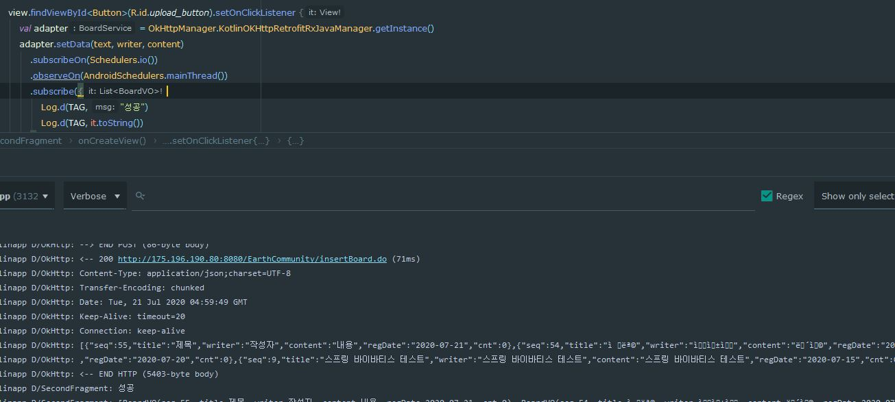
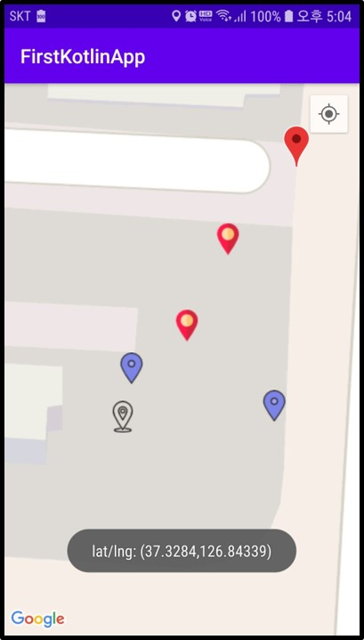

## 일지

### 2020.07.16

- 스프링서버구현, 안드로이드 컴포넌트(탭레이아웃, 뷰페이저2, 프래그먼트 ) 구현

- 스프링서버와 안드로이드 retrofit과 연결 시도

- 실패

- 제이슨 일치시키기, 스프링에서 쏴주는 형식을 찾아보기

- rest ful로 동작하는지 스프링서버에 문제 확인해보기

### 2020.07.17

- 스프링서버와 안드로이드 retrofit과 연결 재시도

- rest ful로 동작잘됨


- 스프링 문제로 가정하고 다른 json형식을 retrofit과 연결될 수 있도록 시도

- retrofit이 다른 사이트의 데이터는 받아온다

- 내가만든 Spring json return raw data와 다른 사이트에서 받아온 raw data 형태가 다르다

- 형태의 문제가 아니였다

- 기존 Spring에서 복사한 VO객체의 Date 가 java.sql.Date를 그대로 사용해서 파싱 형태가 맞지 않아 실패했던거다

- 내부적으로 GsonConverterFactory는 Date 타입은 java.util.Date인거 같다

- java.util.Date로 변경하니 성공하였지만 Date를 간결하게 String타입으로 받기로함(변수명은 일치시키고)


- retrofit 성공

- RxJava + Restrofit을 이용해서도 출력성공함

- 받은 데이터를 분류하는 작업과 안드로이드에서 입력한 데이터를 스프링으로 보내 글 등록하는 과정진행해야 될듯
- 추가적으로 다양한 요청방식에 대한 retrofit의 인터페이스 관련해서 til작성

### 2020.07.18
- 이전에 받은 데이터를 FragmentStateAdapter를 어탭터를 사용하는 ViewPager로 연동되는 fragment에 데이터를 전달시켰다
- RecyclerView와 같은 방식이였음
- StackOverFlow에서도 비슷한 방식을 쓰는거보니 onBindViewHolder로 하는게 맞는거 같은데 FragmentStateAdapter에대한 정보가 주변에 많이 부족하다
- 아직 TIL에 다양한 요청방식에 대한 retrofit의 인터페이스 관련해서 작성은 다음으로 미루고 오늘한 Bind만 작성했다
- 또한 글 등록 요청을 서버에 보내는 것도 밀렸다

### 2020.07.19

- retrofit에 대한 TIL정리 마무리했다
- retrofit을 정리하면서 RxJava에 대해서도 알아야 할 것이 많아졌다
- retrofit 관련 정보를 보다가 버스정류장 시간을 받아오는 간단한 앱이 있는데 실제로 만들면 가볍게 시간을 확인할 수 있을듯
- 서버에 요청하는 로직은 Retrofit + RxJava가 마무리 되는데로 진행할듯

### 2020.07.20

- retrofit을 이용하여 스프링 서버에 요청하여 명령을 수행시켰다
- GET방식 요청은 정상작동되는데 POST방식으로 하면 인코딩이 깨진다


- 인코딩 방식에 대해서 더 알아봐야 겠다
- Retrofit + RxJava을 이용하면 MVVM 디자인 패턴을 사용하는거 같다.
- 인코딩완료 후 프로젝트를 간단한 MVVM 패턴으로 변경해본다

### 2020.07.21

- 인코딩 문제때문에 문제해결을 하던 중 okHttp + RxJava + Retrofit으로 하나의 클래스로 만들어 좀 더 간결하게 만듬
- 인코딩 문제는 여전했지만, 많은 글들을 참고했고 똑같이 했는데 안되는걸 보고 스프링 인코딩 문제라 생각하고 찾던 중 web.xml에

```xml
<filter> 
    <filter-name>encodingFilter</filter-name> 
    <filter-class>org.springframework.web.filter.CharacterEncodingFilter</filter-class> 
    <init-param> 
       <param-name>encoding</param-name> 
       <param-value>UTF-8</param-value> 
    </init-param> 
    <init-param> 
       <param-name>forceEncoding</param-name> 
       <param-value>true</param-value> 
    </init-param> 
</filter> 
<filter-mapping> 
    <filter-name>encodingFilter</filter-name> 
    <url-pattern>/*</url-pattern> 
</filter-mapping> 
```

- `<filter-mapping>`의 `<url-pattern>`이 기존에 `/`로 된걸 `/*` 바꾸고
- `forceEncoding`을 추가했더니

- 기존 인코딩 깨지던 것에서 POST방식으로도 정상적으로 서버에 요청할 수 있게 되었다
- 인코딩 설정 전에는 GET방식은 잘 되었다
- 참고 : [https://gmlwjd9405.github.io/2019/01/01/spring-utf8.html](https://gmlwjd9405.github.io/2019/01/01/spring-utf8.html)
- MVVM 패턴으로 변경하는 일도 어렵고 MVVM 패턴을 이해하는데 많은 시간이 필요할듯
- 구글, 네이버, 카카오 맵 API 적용시키는 중(현재는 구글맵 적용중)


### 2020.07.22

- 구글맵 API를 사용 중에 있다
- 클러스트 매니저를 통해 기본 클러스트 렌더를 이용하여 마커의 밀집도가 높은 곳을 보기쉽게 변경하였다


- 마커를 클릭했을때 이벤트를 발생시키게 만들었다

- 현재는 토스트 메세지로 해당마커의 위치값을 출력시켰다

  

- 또한 마커도 커스텀으로 디자인할 수 있는데 사이즈는 32px*32px가 기본 마커와 사이즈가 비슷하다

  

- 다음에는 관련 내용 TIL에 정리
- 그리고 DB에 마커 관련 데이터를 넣고 앱을 실행할때 Retrofit으로 정보를 받아와 마커로 나타내는 것을 목표로 한다
- 클릭하여 마커를 추가하고 사용자가 데이터를 입력하여 DB처리되는 것까지 포함
- 또한 클릭이벤트로 액티비티를 파업으로 띄우는 것도

### 2020.07.23

- TIL에 GoogleMap기본설정, 퍼미션, 자신의 위치찾기, 마커 클러스터링, 커스터마이즈 작성함
- 정리 하던중 구글맵과 외부 데이터와 연동시키는 에제를 확인했는데 인터넷으로 받은 JSON데이터를 AsyncTask로 처리했는데 적당한 방법을 찾아봐야될듯
- `(HTTPLog)-Static: isSBSettingEnabled false` 관련 문제 해결해야함
- 다음에는 DB테이블작성과 Retrofit을 이용해 적당한 방법으로 연동시키는것을 목표