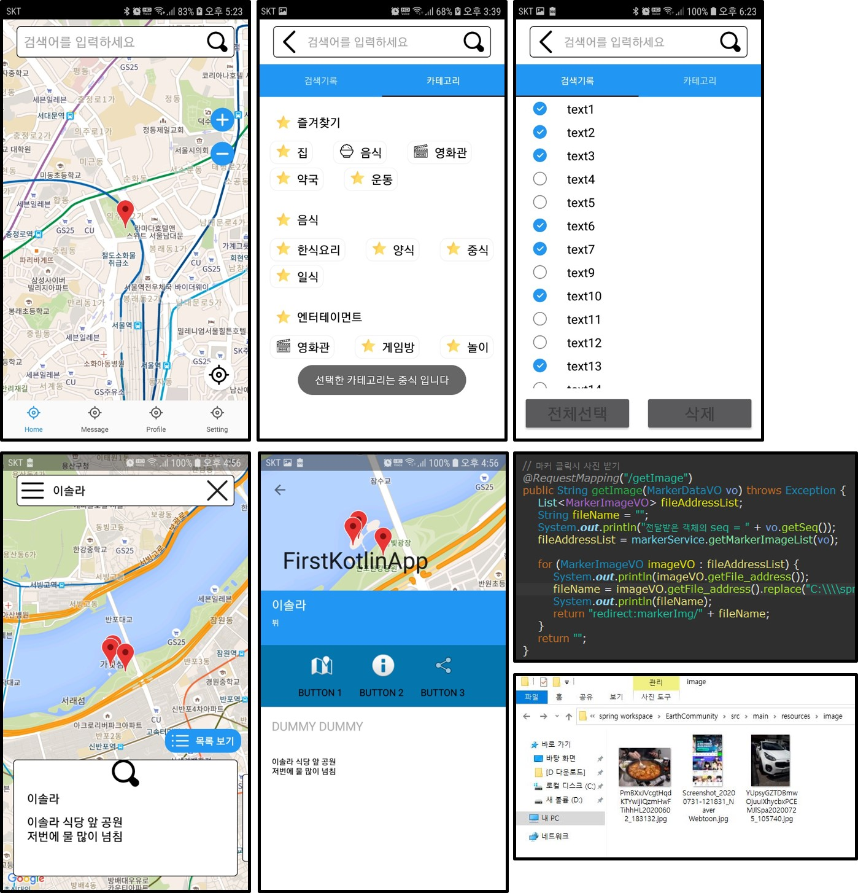

# EC-Project

- 다양한 카테고리로 분류하여 이용자가 원하는 마커를 찾고 등록함으로써 서로 소통할 수 있는 애플리케이션

- **[개발일지](https://github.com/vvvvvoin/EC-Project/blob/master/EC%ED%94%84%EB%A1%9C%EC%A0%9D%ED%8A%B8%20%EC%9D%BC%EC%A7%80.md) 를 확인해주세요**

- 환경
  - AndroidStudio 4.0, only Kotlin
  - Spring Legacy Project
- 사용된 라이브러리

  - RxJAVA
  - Retrofit
  - OkHttp3
  - GSON
  - Coroutine
  - Room
  - ViewModel
  - LiveData
  - ContentResolver
  - GoogleMap
  - BottomSheet
  - Glide
  - ViewPager2
  - BottomNavigation
  - TabLayout
  - RecyclerAdapter
  - FragmentStateAdapter
- 기능
  - 권한설정
  - 구글맵
    - Marker Clustering [(here)](https://github.com/vvvvvoin/EC-Project/blob/master/EC%ED%94%84%EB%A1%9C%EC%A0%9D%ED%8A%B8%20%EC%9D%BC%EC%A7%80.md#20200722)
    - ClusterManager Marker Item event(등록, 수정, 뷰) [(here)](https://github.com/vvvvvoin/EC-Project/blob/master/EC%ED%94%84%EB%A1%9C%EC%A0%9D%ED%8A%B8%20%EC%9D%BC%EC%A7%80.md#20200726)
    - 현재위치 찾기 [(here)](https://github.com/vvvvvoin/EC-Project/blob/master/EC%ED%94%84%EB%A1%9C%EC%A0%9D%ED%8A%B8%20%EC%9D%BC%EC%A7%80.md#20200726)
    - GeoCoder 주소부여
    - BottomSheet를 이용한 마커 뷰 [(here)](https://github.com/vvvvvoin/EC-Project/blob/master/EC%ED%94%84%EB%A1%9C%EC%A0%9D%ED%8A%B8%20%EC%9D%BC%EC%A7%80.md#20200831)
  - MVVM 디자인 패턴 적용 중
  - mobileDB (Room) 
    
    - DB데이터를 ClusterManager를 통해 GoogleMap에 Marker 추가
  - Retrofit + RxJava
    - 스프링서버 접속하여 DB data CRUD처리
    - 사진업로드 기능 [(here)](https://github.com/vvvvvoin/EC-Project/blob/master/EC%ED%94%84%EB%A1%9C%EC%A0%9D%ED%8A%B8%20%EC%9D%BC%EC%A7%80.md#20200802)
  - Coroutine
    
    - mobileDB data 처리 [(here)](https://github.com/vvvvvoin/EC-Project/blob/master/EC%ED%94%84%EB%A1%9C%EC%A0%9D%ED%8A%B8%20%EC%9D%BC%EC%A7%80.md#20200730)[(here)](https://github.com/vvvvvoin/EC-Project/blob/master/EC%ED%94%84%EB%A1%9C%EC%A0%9D%ED%8A%B8%20%EC%9D%BC%EC%A7%80.md#20200809)
  - 스프링서버와 동기화처리 

