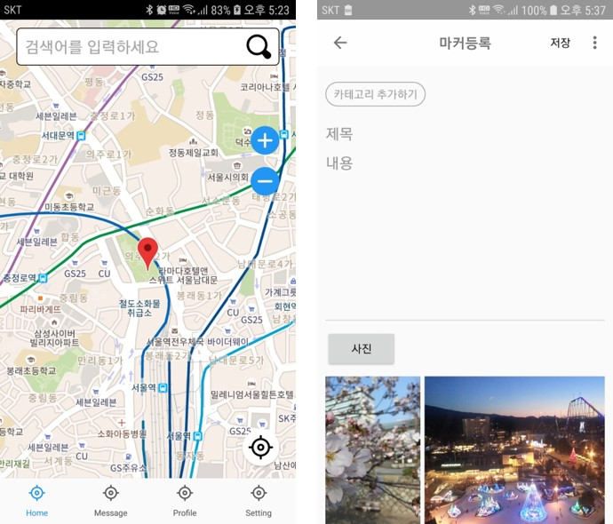

# EC-Project

- 다양한 카테고리로 분류하여 사용자가 원하는 마커를 찾고 등록함으로써 소통할 수 있는 애플리케이션

- [개발일지](https://github.com/vvvvvoin/EC-Project/blob/master/EC%ED%94%84%EB%A1%9C%EC%A0%9D%ED%8A%B8%20%EC%9D%BC%EC%A7%80.md)

- 환경
  - AndroidStudio 4.0
  - Spring Legacy Project
- 기능
  - 권한설정
  - 구글맵
    - Marker Clustering [(here)](https://github.com/vvvvvoin/EC-Project/blob/master/EC%ED%94%84%EB%A1%9C%EC%A0%9D%ED%8A%B8%20%EC%9D%BC%EC%A7%80.md#20200722)
    - ClusterManager Marker Item event(등록, 수정, 뷰) [(here)](https://github.com/vvvvvoin/EC-Project/blob/master/EC%ED%94%84%EB%A1%9C%EC%A0%9D%ED%8A%B8%20%EC%9D%BC%EC%A7%80.md#20200726)
    - 현재위치 찾기 [(here)](https://github.com/vvvvvoin/EC-Project/blob/master/EC%ED%94%84%EB%A1%9C%EC%A0%9D%ED%8A%B8%20%EC%9D%BC%EC%A7%80.md#20200726)
    - GeoCoder 주소부여
  - mobileDB (Room)
    
    - DB데이터를 ClusterManager를 통해 GoogleMap에 Marker 추가
  - RetrofitRxJava
    - 스프링서버 접속하여 DB data CRUD처리
    - 사진업로드 기능 [(here)](https://github.com/vvvvvoin/EC-Project/blob/master/EC%ED%94%84%EB%A1%9C%EC%A0%9D%ED%8A%B8%20%EC%9D%BC%EC%A7%80.md#20200802)
  - Coroutine
    
    - mobileDB data 처리 [(here)](https://github.com/vvvvvoin/EC-Project/blob/master/EC%ED%94%84%EB%A1%9C%EC%A0%9D%ED%8A%B8%20%EC%9D%BC%EC%A7%80.md#20200730)[(here)](https://github.com/vvvvvoin/EC-Project/blob/master/EC%ED%94%84%EB%A1%9C%EC%A0%9D%ED%8A%B8%20%EC%9D%BC%EC%A7%80.md#20200809)
  - 스프링서버와 동기화처리 

